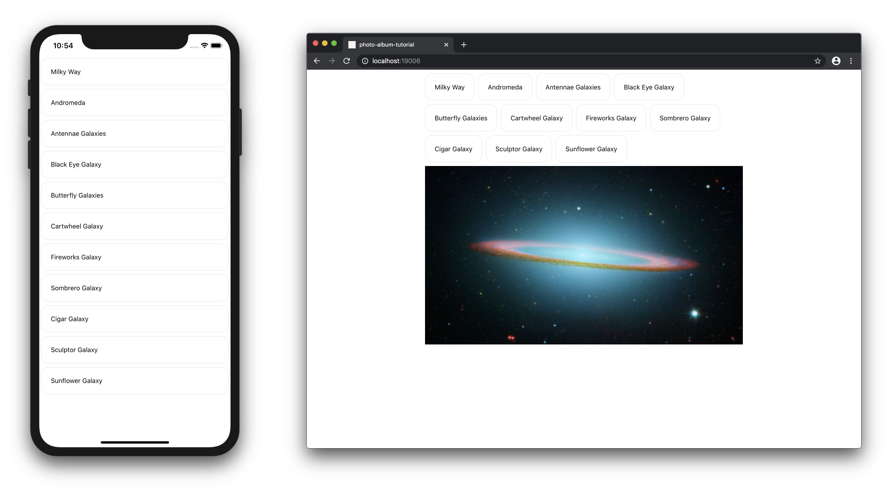
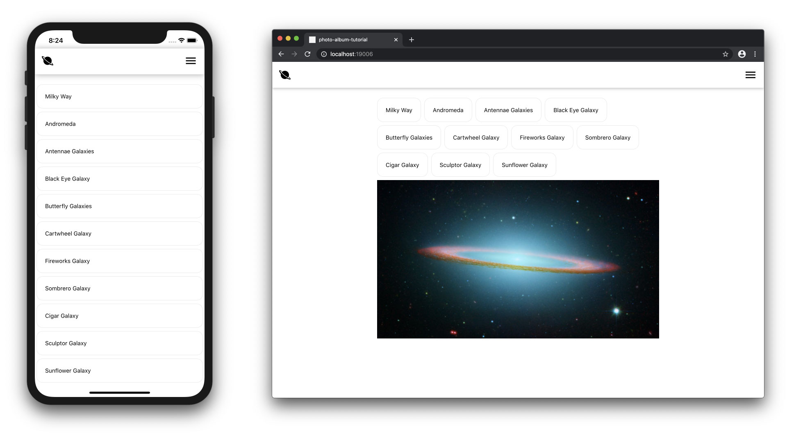
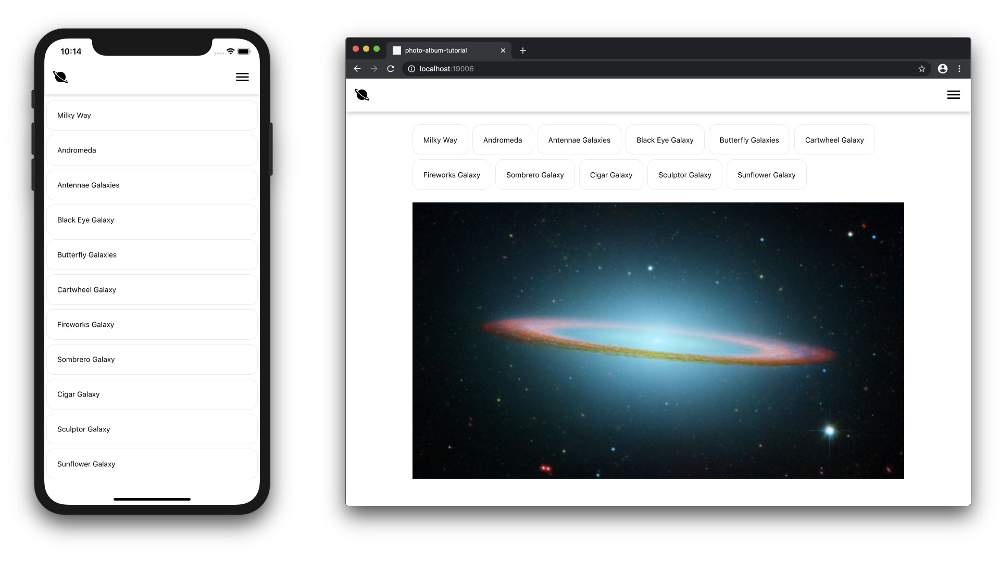
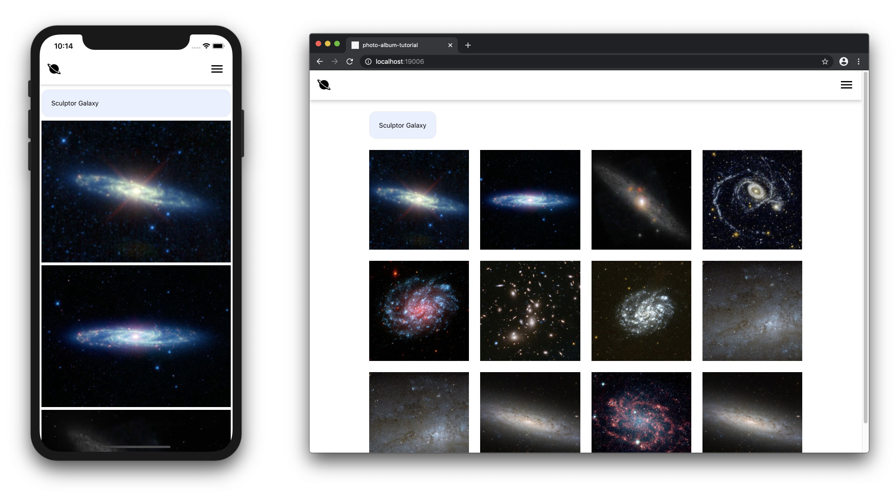

# Responsive UX Design with React Native Reflect (Part 4)

## Description

The following tutorial explains step by step how to create a responsive photo album application with [React Native Reflect](https://sntx.github.io/react-native-reflect) that works on Web and Native devices.

The whole application will be styled in a responsive manner, featuring:

- Image Grid with responsive number of columns, image aspect ratio and grid separation.
- Conditional content rendering, based on screen size.
- Responsive style attributes such as sizes, spacing and shadows.

## Contents

- [Part 1 - Responsive Image Grid](./PART1.md)
- [Part 2 - Improved Responsive Image Grid](./PART2.md)
- [Part 3 - Responsive UI and Theme](./PART3.md)
- [Part 4 - Conditional Rendering and Improved UI](./PART4.md)

## Conditional Content

When there is no search selected, our UI looks quite empty on larger screens. Let's add a fixed full size image below the search buttons only on larger screens. On smaller screens we won't show the fixed image since the buttons are taking most of the screen space.

React Native Images require explicit width and height values. To take care of this, we'll create a new component (`FullWidthImage`) for rendering our full width image. `FullWidthImage` will determine it's width from it's parent component and it's height by dividing its width by an aspect ratio value.

### `src/FullWidthImage.tsx`:

```typescript
import React, { useState } from "react";
import { View, Image, LayoutChangeEvent } from "react-native";

type FullWidthImageProps = { uri: string; aspectRatio: number };

/**
 * Renders full width image by inferring its width from the Image's parent
 * component and its height using an aspect ratio value.
 */
export default function FullWidthImage({
  uri,
  aspectRatio = 1,
}: FullWidthImageProps) {
  const [width, setWidth] = useState(0);

  // set Image's width to the width of its parent component
  const onLayout = (obj: LayoutChangeEvent) =>
    setWidth(obj.nativeEvent.layout.width);

  return (
    <View onLayout={onLayout}>
      <Image style={{ width, height: width / aspectRatio }} source={{ uri }} />
    </View>
  );
}
```

Now, add the following lines to `App.tsx`, to use the new component we created and to add the logic to display our full width image only on larger screens.

```typescript
import FullWidthImage from "./src/FullWidthImage";
```

```typescript
const COVER_IMAGE_URI =
  "https://images-assets.nasa.gov/image/0700064/0700064~medium.jpg";
```

We can very easily create conditional rendered components using [Reflect](https://sntx.github.io/react-native-reflect) responsive attrs. Below, add `attrs.displayHomeImg: [false, true]` which will be `false` on smaller screens and `true` on larger screens.

```typescript
  const { attrs, styles } = useStyled({
    ...
    attrs: {
      ...
      // only show cover image on small screens
      displayHomeImg: [false, true],
    },
  });
```

Then, let's use our newly created `attrs.displayHomeImg` value on our App's `render()` method.

```typescript
return (
  <ThemeProvider value={theme}>
    <SafeAreaView>
      <Container>
        <SearchTerms onChange={createQuery} />
        {(() => {
          if (isLoading) return <MyActivityIndicator />;

          // display cover image only on larger screens when there is no
          // other data to display
          if (data.length === 0 && attrs.displayHomeImg)
            return (
              <FullWidthImage aspectRatio={16 / 9} uri={COVER_IMAGE_URI} />
            );

          return (
            <ImageGrid
              data={data}
              numColumns={attrs.numColumns}
              aspectRatio={attrs.imageAspectRatio}
              gridGap={styles.gridGap.margin as number}
            />
          );
        })()}
      </Container>
    </SafeAreaView>
  </ThemeProvider>
);
```

Your App should look like this:



## Navigation Bar

Next, let's create a dummy navigation bar with a logo and some other elements. Add the following lines to `App.tsx`

```typescript
import { Ionicons } from "@expo/vector-icons";
```

```typescript
const NavBar = styled(View, {
  flexDirection: "row",
  alignItems: "center",
  justifyContent: "space-between",
  backgroundColor: "white",
  height: 7, // theme.sizes[7] = 64
  borderWidth: 0, // theme.borderWidths[0] = 1
  borderColor: "lightGray", // theme.colors["lightGray"] = "#EAEBEE"
  marginBottom: 4, // theme.space[4] = 16
  paddingLeft: 4, // etc.
  paddingRight: 5,
  shadowColor: "black",
  shadowOffset: { width: 0, height: 1 },
  shadowOpacity: 0.3,
  shadowRadius: 8,
  elevation: 1,
});
```

```typescript
  return (
    <ThemeProvider value={theme}>
      <SafeAreaView>
        <NavBar>
          <Ionicons name="md-planet" size={32} color="black" />
          <Ionicons name="md-menu" size={32} color="black" />
        </NavBar>
        ...
    </ThemeProvider>
```



Notice that `<NavBar>` renders its shadows below and above itself which looks bad on some mobile devices because of the top spacing created by `<SafeAreaView>`. One way to fix this is by using `react-native-safe-area-context` instead of `SafeAreaView`.

To get native links working, install `react-native-safe-area-context` with `expo`:

```bash
expo install react-native-safe-area-context@latest
```

**NOTE: `react-native-safe-area-context` was having some issues for me with Expo 37, after I upgraded my Expo app to 38.0.0, the installation worked just fine.**

Then, replace the following lines in `App.tsx`

Remove `SafeAreView`, we'll use imports from `react-native-safe-area-context` insted:

```typescript
import { View, ActivityIndicator } from "react-native";
...
import {
  SafeAreaProvider,
  useSafeAreaInsets,
} from "react-native-safe-area-context";
```

Create a more complex `NavBar` component that applies shadows to a `Wrap` wrapper component and compensates for the top inset spacing with an empty `View` component. Read the comments in the code below for more info:

```typescript
const NavBar = ({ children }) => {
  const insets = useSafeAreaInsets();

  const Bar = styled(View, {
    flexDirection: "row",
    alignItems: "center",
    justifyContent: "space-between",
    backgroundColor: "white",
    // theme.sizes[7] = 64
    height: 7,
    // theme.borderWidths[0] = 1
    borderWidth: 0,
    // since theme.borderWidths[0] is 1, we can use "px" suffix to ignore the
    // theme. "0px" gets gets converted to 0 (number)
    borderTopWidth: "0px",
    // theme.colors["lightGray"] = "#EAEBEE"
    borderColor: "lightGray",
    paddingLeft: 4,
    paddingRight: 5,
  });

  const Wrap = styled(View, {
    // smaller screens: theme.space[2] = 4
    // larger  screens: theme.space[4] = 16
    marginBottom: [1, 4],
    shadowColor: "black",
    shadowOffset: { width: 0, height: 1 },
    shadowOpacity: [0.2, 0.3],
    shadowRadius: [3, 10],
    backgroundColor: "white",
    elevation: [0.2, 0.8],
  });

  return (
    <Wrap>
      <View style={{ height: insets.top }} />
      <Bar>{children}</Bar>
    </Wrap>
  );
};
```

Let's adjust some other style values to make our app look better:

```typescript
const Container = styled(View, {
  // small  screens: 2 -> theme.space[2] = 4
  // medium screens: 7 -> theme.space[7] = 64
  // medium screens: 8 -> theme.space[9] = 128
  marginRight: [2, 7, 8],
  marginLeft: [2, 7, 8],
});
```

```typescript
const SearchTermsWrap = styled(View, {
  paddingBottom: [0, 4],
});
```

Finally, let's update our main `render()` method:

```typescript
return (
  <ThemeProvider value={theme}>
    <SafeAreaProvider>
      <NavBar>
        <Ionicons name="md-planet" size={32} color="black" />
        <Ionicons name="md-menu" size={32} color="black" />
      </NavBar>
      <Container>
        <SearchTermsWrap>
          <SearchTerms onChange={createQuery} />
        </SearchTermsWrap>
        ...
      </Container>
    </SafeAreaProvider>
  </ThemeProvider>
);
```

Your app should like like this:





### The End

Hope you enjoyed working with [Reflect](https://sntx.github.io/react-native-reflect). If you decide to use it in your projects, have questions or feedback, or just want to say hello, please write a comment below!


### Links

- Tutorial's source code: https://github.com/sntx/photo-album-tutorial
- React Native Reflect Docs: https://sntx.github.io/react-native-reflect
- Let's connect on Twitter: https://twitter.com/sntx_dev
- Reflect's Twitter: https://twitter.com/rnreflect
